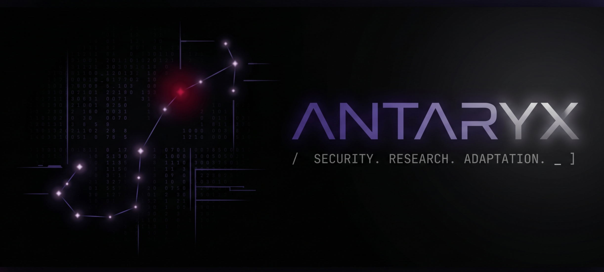

  

 

> _Null routing noise. Blue team logic, Red team mechanics._

 

### ↳ `/sys/core_focus`
I operate in the hybrid space between defensive architecture and offensive vulnerability research. My work focuses on building adaptive security solutions and understanding exploitation mechanics to neutralize them.

*   **Blue Team (Defense):** Digital Forensics, Threat Hunting, Log Analysis, and Risk Management.
*   **Red Team (Offense):** Vulnerability Research, Custom Payload Engineering, and Stealth Automation.
*   **Architecture:** WSL/Linux Environments, Containerized Tooling, and Secure Deployments.

---

### ↳ `/usr/bin/stack`
`Python` • `Bash` • `Linux` • `Docker` • `Django` • `Git`

---

### ↳ `/var/log/transmissions`
*   **Secure Comm:** `antaryx@proton.me`
*   **HackTheBox:** `[antaryx](link-to-your-htb-profile)`
*   **TryHackMe:** `[antaryx](link-to-your-thm-profile)`

 

  

